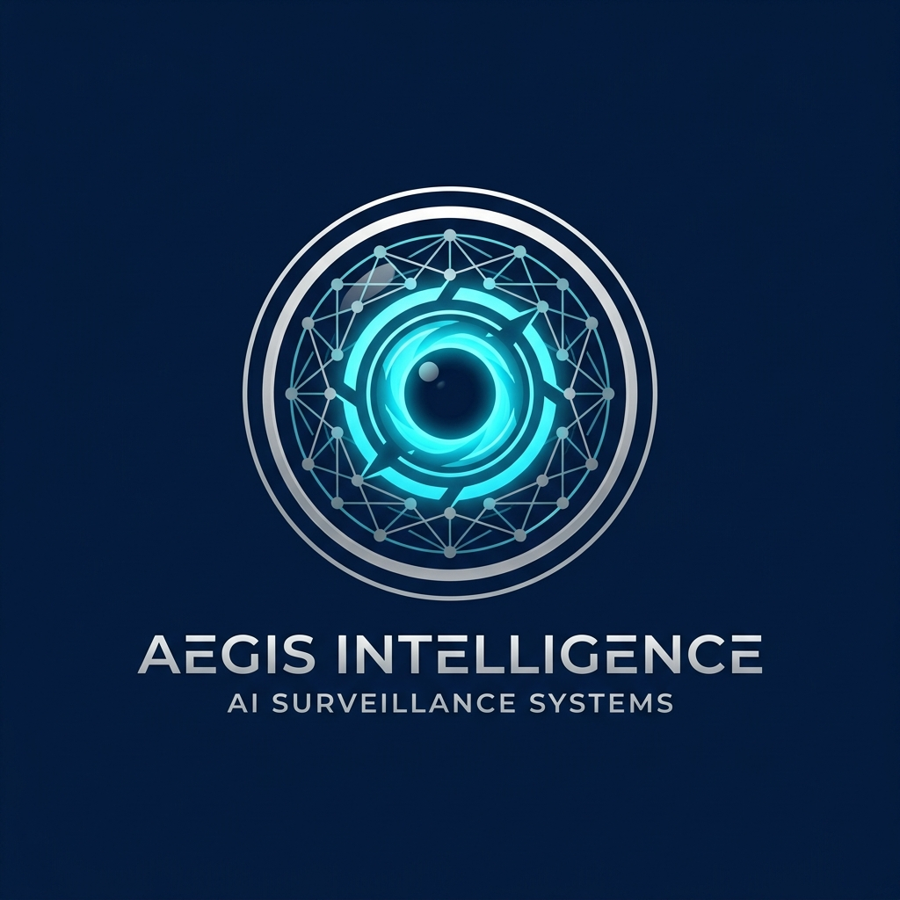

<div align="center">



# 🛡️ AI Surveillance & Intelligent Monitoring System

[](https://fastapi.tiangolo.com)
[](https://nextjs.org)
[](https://streamlit.io)
[](https://ultralytics.com)
[](https://deepmind.google/technologies/gemini/)

**A high-performance, multi-layered AI surveillance platform with real-time detection, tracking, and intelligent log analysis.**

[Overview](#-architecture-overview) • [Features](#-key-features) • [Installation](#-setup-instructions) • [API](#-api-reference) • [Contribute](#-contributing)

</div>

---

## 🏛️ Architecture Overview

The system is designed with a decoupled architecture for maximum scalability and performance. It processes video streams frame-by-frame, applying detection, tracking, and behavior analysis logic before broadcasting results via a REST API.


### 🔄 Data Flow
1.  **Vision Layer**: YOLOv8 detects entities; DeepSORT maintains identity across frames.
2.  **Logic Layer**: Analyzes movements against predefined behaviors (Overcrowding, Loitering, etc.) or custom JSON rules.
3.  **Intelligence Layer**: Google Gemini AI provides semantic summaries and situational context.
4.  **Action Layer**: Dispatches alerts via Email (SMTP) and plays localized audio warnings.
5.  **Presentation Layer**: Live dash via Next.js (modern UI) or Streamlit (monitoring hub).

---

## 🔥 Key Features

| Feature | Description |
| :--- | :--- |
| **🔥 Fire Detection** | Real-time visual fire and smoke detection modules. |
| **🚨 Overcrowding** | Triggers alerts when person count exceeds threshold in specific zones. |
| **⌛ Loitering Detection** | Monitors individuals dwelling in restricted areas beyond allotted time. |
| **🧠 Gemini AI Insights** | Automatic generation of human-readable incident summaries. |
| **✉️ Automated Alerts** | Instant email notifications with incident details and timestamps. |
| **⚙️ Live Rule Engine** | Hot-reloadable JSON rules for dynamic site-specific monitoring. |

---

## 🛠️ Tech Stack

### Backend
- **Python 3.10+**: Core logic.
- **FastAPI / Flask**: API orchestration.
- **YOLOv8 & DeepSORT**: Computer Vision engine.
- **Google Generative AI**: LLM backend for insights.

### Frontend Options
- **Next.js & TailwindCSS**: A premium, responsive interface with Framer Motion animations.
- **Streamlit**: Dedicated internal monitoring dashboard for rapid deployment.

---

## 🚀 Setup Instructions

### 1️⃣ Clone and Initialize
```bash
git clone https://github.com/hameed-afsar-km/AI-Surveillance-System.git
cd AI-Surveillance-System
python -m venv venv
source venv/bin/activate  # Or .\venv\Scripts\Activate.ps1 on Windows
pip install -r requirements.txt
```

### 2️⃣ Configure Environment
Create a `.env` file in the root:
```ini
GEMINI_API_KEY=your_key_here
EMAIL_SENDER=your_email@gmail.com
EMAIL_PASSWORD=your_app_password
EMAIL_RECIPIENTS=admin@example.com
```

### 3️⃣ Start the Services

**Terminal 1: Backend**
```bash
cd backend
python app.py
```

**Terminal 2: Streamlit Dashboard**
```bash
cd frontend-streamlit
streamlit run app.py
```

**Terminal 3: Next.js Frontend**
```bash
cd frontend-nextjs
npm install
npm run dev
```

---

## 🌐 API Reference

| Endpoint | Method | Description |
| :--- | :---: | :--- |
| `/status` | `GET` | Snapshot of current detection metrics. |
| `/start` | `POST` | Initialize stream processing (Webcam/File). |
| `/stop` | `POST` | Terminate active processing. |
| `/stream` | `GET` | MJPEG real-time video stream. |
| `/events` | `GET` | Retrieve history of detected incidents. |

---

## 🎨 Design Aesthetics

- **Dark Mode First**: Optimized for security control rooms.
- **Inter Font Family**: High legibility for critical alerts.
- **Glassmorphism**: Modern, premium feel for dashboard elements.
- **Micro-animations**: Subtle cues for interactive feedback.

---

## 🤝 Contributing

Contributions are welcome! Please follow these steps:
1. Fork the Project.
2. Create your Feature Branch (`git checkout -b feature/AmazingFeature`).
3. Commit your Changes (`git commit -m 'Add some AmazingFeature'`).
4. Push to the Branch (`git push origin feature/AmazingFeature`).
5. Open a Pull Request.

---

<div align="center">

Built with ❤️ by **Antigravity** & the AI Surveillance Team

[](https://opensource.org/licenses/MIT)

</div>
